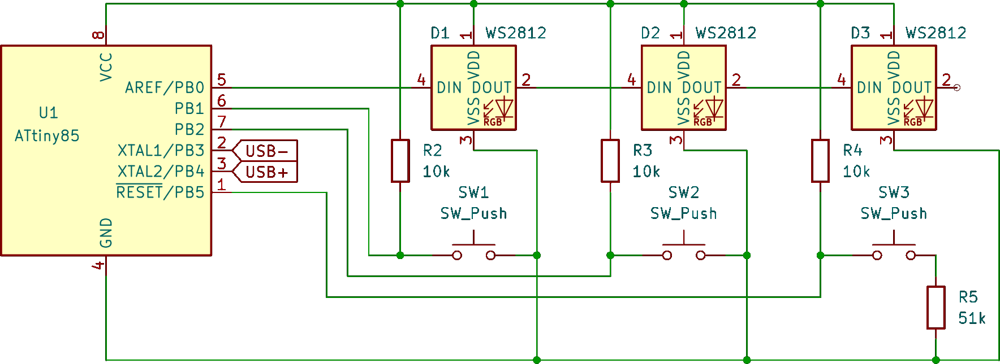
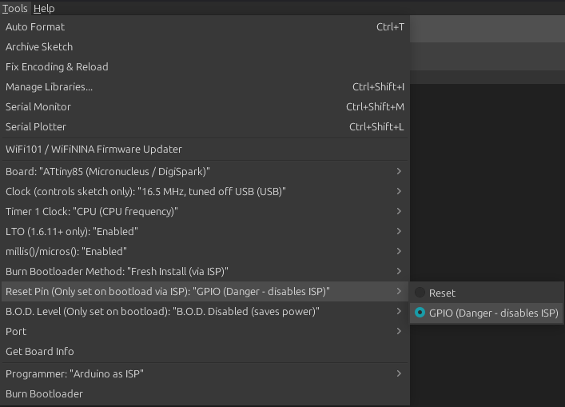

# Digispark Macro Keyboard

Simple macro keyboard using a digispark ATTiny85 and WS2812B LEDs for RGB lighting.

## Circuit

### WS2812B LEDs
The WS2812B LEDs are controlled via the OneWire protocol and as the name says, we need only one pin to controll them all. They are addressed by the order they are wired in.

### Pullup resistors
I tried using the `INPUT_PULLUP` pin mode to set the button pins high on default but couldn't get it to work - perheps because the cheap ATTiny85 chicks I got do not even implement it? Anyway, it works much better when using dedicated pullup resistors. For this purpose, a 10kΩ resistor seems a good choice to keep the voltage up until the push button is pressed and the connection to ground pulls it low.

### Voltage divider
Using PB5 as an input can be done in two ways: First, by flashing the fuses to disable the reset functionality and second, by using a voltage divider to keep the voltage above ½ teh supply voltage because it would otherwise trigger a reset. Flashing the fuse can be used when using Micronucleus via USB exclusively to flash a new program, otherwise a high-voltage programmer is needed. This might not be a problem when using the USB flashing anyway but in case you want to use an external flasher to avoid the few seconds flash mode when connection the keyboard, this makes it a bit more complicated. Using the voltage divider instead allows to flash the ATTiny85 via an external flasher while also using PB5 as input by reading the analog input value which is lowered by the voltage divider. The down-side here is that reading an analog value takes lo0nger but in the case of a simple macro keyboard that doesn't make any noticible difference.

I had a good result using a 10kΩ to 51kΩ setting which loweres the analog value from 1023 reliably below 900 when the push button is pressed.

In case you wanna set the fuse instead, I used the [ATTinyCore](https://github.com/SpenceKonde/ATTinyCore) to flash the Micronucleus bootloader with the Reset Pin set to `GPIO`:

